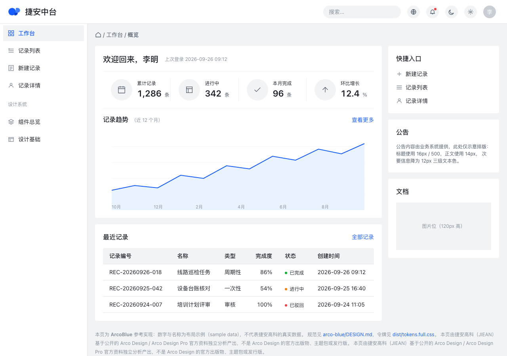
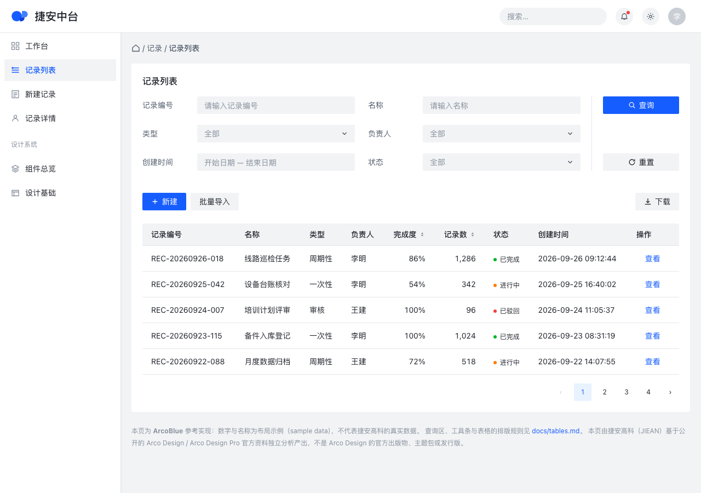
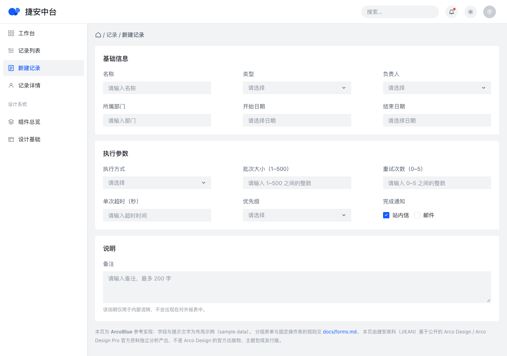
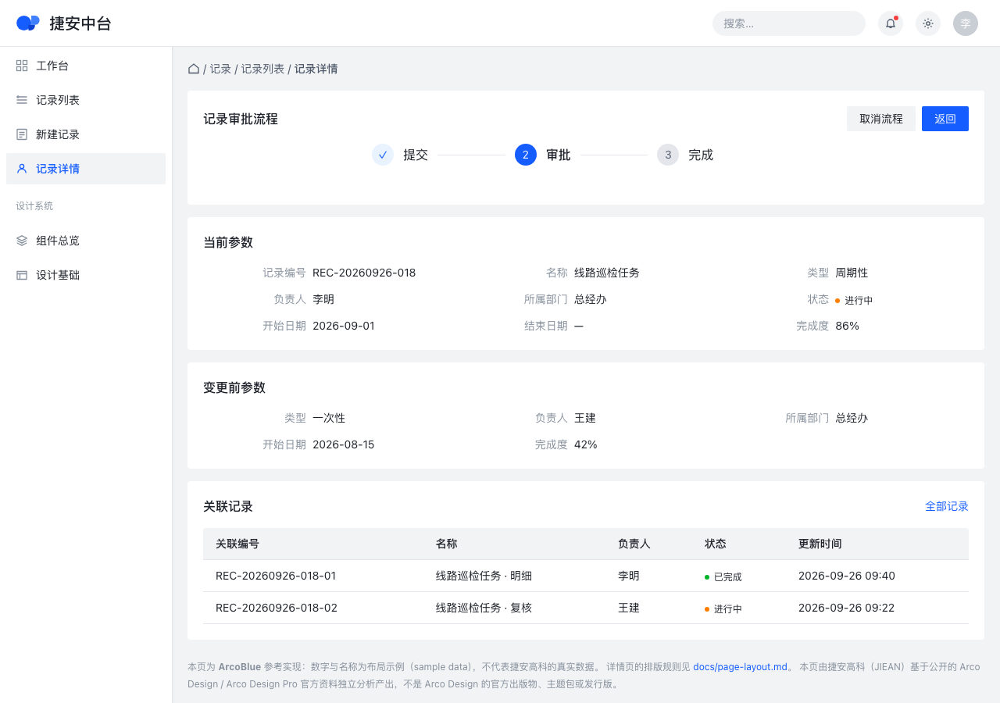

# arco-blue

**English** · [中文版](README_zh-CN.md)

The enterprise style package of the JIEAN Design System — `arco-blue`
(ArcoBlue / 阿科蓝).

## What is arco-blue?

`arco-blue` is JIEAN's enterprise application style package: a token set, a written
pattern language, and a reference implementation, all describing one density and
one tone — a data-dense internal application where operators, engineers and
managers spend a working day.

It is deliberately small in vocabulary and strict in the few things it says. It
specifies 34 colours, 11 typography roles, 13 spacing steps, 5 radii and 61
component tokens; it does not specify a component library. An implementation may
use Arco React, Ant Design, a Tailwind build, hand-written CSS, or anything else.
Whichever it uses, the values and the patterns come from here.

The name is a style package name, not a product name. It says which package you
are reading, in the same way `arco-blue-compact` would say which one it is.

## Visual Examples

Four pages, each rendered from the committed HTML at a 1280×900 viewport, DPR 1,
light theme, no JavaScript, no build step. Each PNG sits beside the page it was
rendered from, and each page is self-contained: its stylesheet is inlined, so
`examples/` is a flat directory of eight files.

| Page | Preview |
|---|---|
| Workbench — KPI row, trend chart, recent-records table, right rail |  |
| List page — query area, toolbar, dense table |  |
| Form page — three-column grouped form, inline states, fixed action bar |  |
| Detail page — steps, current and previous parameter blocks, related records |  |

The previews are checked, not decorative: `npm run 10:screenshots` verifies each
file exists, is a real PNG, is exactly 1280×900, is no older than the HTML and
tokens it was rendered from, and **carries the declared palette on its pixels** —
`canvas`, `surface`, `primary` and `text-primary` must each cover at least the
documented floor, and neither of the other two packages' primaries
may appear at all. Regenerate with `npm run 11:screenshots:write`. What the
renders do and do not prove is in `reports/visual-validation.md`.

## Design Source

`arco-blue` was reverse-engineered from **Arco Design Pro**, the enterprise
application template maintained by ByteDance, and from its official theme package.

| Source | Revision used | Role |
|---|---|---|
| `react-pro.arco.design` | live, signed in, 2026-09-26 | the visual reference: what the pages actually render |
| `@arco-themes/react-arco-pro` | 0.0.7 (MIT) | token values: colour, type, spacing, radius |
| `arco-design-pro` source | commit `bb6aebcc…`, 2024-04-26 (MIT) | structural intent: region sizes, where rules are drawn |
| `@arco-design/web-react` | 2.66.16 (MIT) | component geometry |

Preferring source code over visual guessing is the rule this package was built
under; where the two disagreed, a measurement of the running page decided it. Four
reference pages were rendered at a 1270×848 viewport and both their computed
styles and their pixels were captured; the result of comparing this package
against them is in `reports/visual-validation.md`. Every value's provenance is in
`reports/source-audit.md`, and the raw readings are kept under `reports/evidence/`.

JIEAN's own additions — the density rules, the empty/long/contradictory states, the
permission and workflow patterns, the accessibility decisions — are marked as such
where they appear. Nothing in this package implies it is an official Arco product.

## What DESIGN.md Is

`DESIGN.md` is the design contract. It is two documents in one file:

- **The frontmatter is machine-readable.** It holds the token set that the official
  Google DESIGN.md toolchain reads to lint, resolve and export. It is the single
  source of truth for every value: no colour, size, space or radius exists in this
  package that is not there.
- **The prose is for people.** It says what each group of tokens is for, where the
  numbers came from, which tradeoffs were taken, and what will go wrong if they are
  ignored.

Everything else in this package is derived from it or explains it:
`tokens/` and `dist/` are generated from it, `docs/` applies it, `examples/`
demonstrates it, and `reports/` shows its provenance. **A change to a value starts
in `DESIGN.md`**, then flows outward through `npm run 2:export`.

The format is not a house invention. It is Google's DESIGN.md specification, the
version of which is recorded in `reports/designmd-validation.md` together with the
toolchain's real behaviour — including the things it silently drops.

## Repository Structure

```text
arco-blue/
├── DESIGN.md                the contract: tokens + reasoning
├── README.md                this file
├── docs/                    14 pattern documents
│   ├── foundations.md            the model behind the tokens
│   ├── application-shell.md      the page frame
│   ├── page-layout.md            page types and grids
│   ├── navigation.md             the sidebar, breadcrumb and tabs
│   ├── forms.md                  labels, controls, validation, the submit bar
│   ├── tables.md                 the workhorse surface
│   ├── search-filter.md          query and result
│   ├── cards.md                  card anatomy and the KPI card
│   ├── feedback.md               messages, confirmations, loading, empty
│   ├── data-visualization.md     charts and the metric layer
│   ├── workflow.md               multi-step and approval patterns
│   ├── permission.md             role-visible UI and the safety rules
│   ├── accessibility.md          contrast, focus, keyboard, motion
│   └── responsive.md             the supported range and what degrades
├── tokens/
│   └── tokens.json              official DTCG export
├── dist/
│   ├── tokens.css               official CSS custom properties
│   ├── tailwind.theme.json      official Tailwind theme
│   ├── tokens.full.css          derived: 217 custom properties (lossless)
│   └── tokens.full.json         derived: lossless, includes line heights,
│                                font features and all 75 component tokens
├── examples/                the reference implementation, flat and self-contained
│   ├── dashboard.html       + dashboard.png
│   ├── list-page.html       + list-page.png
│   ├── form-page.html       + form-page.png
│   └── detail-page.html     + detail-page.png
└── reports/
    ├── source-audit.md          where every value came from
    ├── designmd-validation.md   what the toolchain really does
    ├── visual-validation.md     what the previews prove
    ├── machine-validation.json  the structural checks, machine-readable
    └── evidence/                the derivation and the cross-package diff
```

## Quick Start

```bash
git clone <this repository>
cd jiean-design-system
npm install          # one dependency: @google/design.md
npm run check        # lint + export + verify + hygiene
open arco-blue/examples/dashboard.html
```

Node 18 or newer. There is no build step for the examples: open the HTML file, or
serve the repository root with any static server if you prefer.

The scripts:

| Command | What it does | Fails when |
|---|---|---|
| `npm run 1:validate` | lints `DESIGN.md`, prints token counts and section names | the contract does not parse, or lint reports an error |
| `npm run 2:export` | runs the official CLI for three formats, then derives the lossless pair | the CLI fails, or an artifact comes out empty |
| `npm run 3:verify-generated` | 26 checks: provenance, losslessness, known toolchain limitations, contrast | any artifact drifted from the contract |
| `npm run 4:capture` | renders the four example pages headless and records computed styles | a page does not reach a 1270×848 viewport, or Chrome fails |
| `npm run 5:compare` | compares 75 values against the reference: 16 pixel checks over four page pairs, 38 dashboard landmarks, 21 shell landmarks on the other three pages | any compared value drifts |
| `npm run 6:hygiene` | placeholders, links, JSON validity, required files, naming | a link is broken, a file is missing, a placeholder survives |
| `npm run check` | `1 → 2 → 3 → 6` | as above; this is the CI gate |
| `npm run check:visual` | `4 → 5` | as above; needs Chrome, so it is not in CI |

## Human Developer Usage

You do not need an AI tool, a React project or this repository's tooling to build
against `arco-blue`.

1. **Read the design specification.** `DESIGN.md`. Read the prose sections for the
   part of the UI you are building; the frontmatter is for the tools.
2. **Inspect semantic tokens.** The 34 colours are named by role — `primary`,
   `canvas`, `surface`, `text-secondary`, `border` — not by appearance. Read
   `dist/tokens.full.json` for the complete resolved set, including line heights,
   font features and component tokens.
3. **Use the generated CSS.** `dist/tokens.full.css` defines 217 custom
   properties, ready for plain CSS, or `dist/tokens.css` if you want the official
   output exactly as the CLI produced it. `dist/tailwind.theme.json` drops into a
   Tailwind config.
4. **Find component guidance.** `docs/` — one document per pattern area, each with
   values, states, density and contrast notes.
5. **Find enterprise patterns.** `docs/workflow.md` (multi-step and approval),
   `docs/permission.md` (role-visible UI), `docs/tables.md` (the dense surface),
   `docs/feedback.md` (the states that are usually forgotten).
6. **Implement in any stack.** The examples are framework-free HTML and CSS; the
   same values work in React, Vue or a server-rendered page. Nothing in `DESIGN.md`
   refers to a component library.
7. **Validate your changes.** `npm run check` after editing the contract; and if
   you touched a page, `npm run check:visual` to compare it against the reference
   landmarks.

## Generic AI Coding Agent Usage

Any capable coding agent, whatever the vendor:

```text
Before implementing or modifying UI:

1. Read arco-blue/DESIGN.md.
2. Read the relevant files under arco-blue/docs/.
3. Treat JIEAN Design System / arco-blue as the authoritative
   visual and interaction specification.
4. Reuse the documented tokens and patterns.
5. Do not introduce conflicting design values.
```

That is the whole instruction. It is vendor-neutral on purpose: the authority is
the file, not the tool reading it.

## Codex Example

```text
Read AGENTS.md, then follow it.
Task: build the ticket list page for the maintenance module.
It is a list page: read arco-blue/docs/tables.md, search-filter.md and page-layout.md
before writing any UI. Use arco-blue/dist/tokens.full.css for values.
```

## Claude Code Example

```bash
claude "Read AGENTS.md and arco-blue/DESIGN.md, then build the inspection
        detail page following arco-blue/docs/page-layout.md and cards.md."
```

## Gemini CLI Example

```bash
gemini -p "Follow AGENTS.md. Build a form page for equipment registration using
           arco-blue: read DESIGN.md plus docs/forms.md and docs/application-shell.md
           first, and use only the documented tokens."
```

## Cursor / Copilot Usage

Add to the project's rules file:

```text
JIEAN Design System / arco-blue is the authoritative design specification for this
repository. Read AGENTS.md before generating UI, then arco-blue/DESIGN.md and the
relevant document under arco-blue/docs/. Never introduce a colour, size, spacing,
radius or pattern that is not in the specification.
```

## Using the Tokens

Pick the artifact that matches the consumer:

| Consumer | Use | Why |
|---|---|---|
| Plain CSS, any framework | `dist/tokens.full.css` | 217 custom properties: every colour, type role, space, radius and component token, with line heights |
| Tailwind | `dist/tailwind.theme.json` | official theme output; line height and weight per size |
| Design tooling, other languages | `tokens/tokens.json` | official DTCG output |
| Anything that needs the resolved set | `dist/tokens.full.json` | lossless: includes what no official format carries |

```css
.card {
  background: var(--color-surface);
  border: 1px solid var(--color-border);
  border-radius: var(--rounded-md);
  padding: var(--spacing-card);
}
```

Two rules apply whichever artifact you use: **reference tokens by role, not by
value**, and **do not hard-code a value that has a token**. If a needed value has
no token, that is a gap in the contract — raise it as a contract change rather than
a local exception.

## Validation

`npm run check` is the gate. It runs the official linter over `DESIGN.md`, exports
the tokens with the official CLI, verifies the generated artifacts against the
contract (including that the contract's sha256 in the artifacts still matches) and
checks repository hygiene. CI runs the same command, so a green run locally means a
green run in CI.

`npm run check:visual` additionally re-renders the four example pages and compares 75
values against the recorded reference: 16 pixel checks over four page pairs, 38
dashboard landmarks, and 21 shell landmarks on the other three pages. It needs Chrome, so
it is run locally and reported in `reports/visual-validation.md` rather than gated
in CI.

## Updating arco-blue

1. Change a value in `arco-blue/DESIGN.md`. Nothing else has a value in it.
2. `npm run 2:export` — regenerate the token artifacts. The contract's sha256 is
   written into the derived files.
3. `npm run 3:verify-generated` — confirm the exports still agree and nothing was
   lost. A change that breaks a limitation check means the toolchain changed
   behaviour, which is worth knowing before the rest of the repository follows.
4. If the change affects the shell, a page or a component's appearance, update
   `examples/` and run `npm run check:visual`.
5. Update `docs/` where the change contradicts something written there. The docs
   are checked for links, not for agreement — keeping them in step is a review
   responsibility.
6. `npm run check`, then add a `CHANGELOG.md` entry.

The toolchain version is pinned in `package.json`. Updating it is a deliberate
change: read `reports/designmd-validation.md` first, bump the pin, re-run
`npm run 3:verify-generated`, and expect to update that report if any recorded
behaviour has moved. Do not float the version.

## Versioning

`arco-blue` versions as a design system, not as a library. The package version is
`MAJOR.MINOR.PATCH` with the four kinds of change distinguished by what a consumer
has to do:

| Change | Version | What a consumer does |
|---|---|---|
| Documentation only — prose, examples, clarifications | patch | nothing |
| Token value change within the same role and intent (a corrected hex, a tightened spacing step) | patch | re-import the artifact |
| New tokens, new roles, new patterns; or visual behaviour changes in a way that is additive | minor | re-import, adopt at leisure |
| A token's meaning changes, a token is removed, a pattern is replaced, or an existing screen would look different after re-importing | major | schedule the migration; do not re-import silently |

Two things are worth stating plainly. **A changed hex is a patch only if the role
kept its intent** — if `primary` stops meaning JIEAN blue, that is a major change
regardless of how few characters were edited. And **a major change must name its
replacement**: this system has no room for a value that is deprecated without a
successor, because a consumer who cannot migrate cannot stay.

Contract format changes version separately and are recorded in
`reports/designmd-validation.md`; a change to the DESIGN.md format is a repository
change, not a design change, and is never a reason to alter a token value.

## Known Limitations

Stated here because a design system that hides its limits gets used past them.

1. **No official export carries the 75 component tokens, and only one carries
   typography.** `dist/tokens.css` is colours, spacing and radii only. Use
   `dist/tokens.full.css` or `dist/tokens.full.json` when you need component
   tokens or type. The reason and the exact losses are in
   `reports/designmd-validation.md`.
2. **`lineHeight` must be written as a px dimension in the contract.** A unitless
   multiplier is dropped silently by the toolchain — no error, no warning. The
   contract uses pixel values and `3:verify-generated` asserts the pitfall still
   exists.
3. **The reference is not responsive below 1100px**, and neither is this system's
   documented layout: `--component-shell-content-width` is a minimum, not a fixed
   width. Below 1100px the layout changes character, and `docs/responsive.md` says
   what is expected instead.
4. **One 14px line height, where the reference has two.** The reference sets 14px
   text at a 21px line box in the shell and 22.001px in table cells; this system
   uses 22px everywhere. Documented in `reports/visual-validation.md` §5.
5. **States were not visually compared.** Hover, focus and pressed are specified and
   contrast-audited, but the fidelity comparison is a static render.
6. **The examples are a reference implementation, not a component library.** They
   are HTML (styles inlined) and the token file, written to demonstrate the
   specification. They are not intended to be copied into a product as-is.
7. **`css-tailwind`, `tailwind` and `diff` from the official CLI are unexercised.**
   They were not needed for the deliveries this package makes; see
   `reports/designmd-validation.md` §7.
