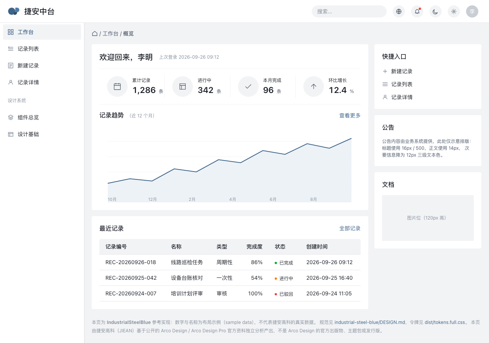
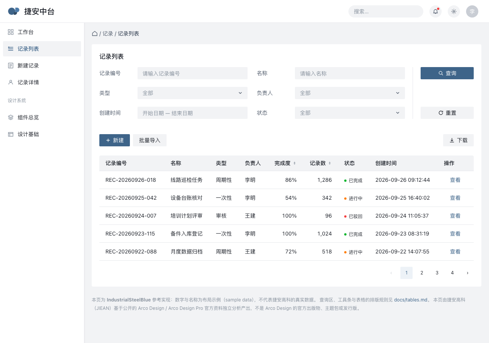
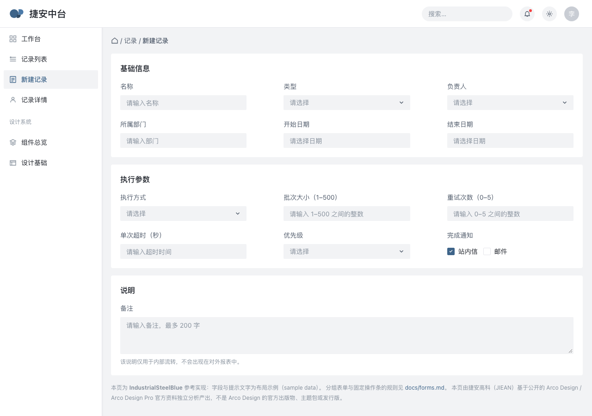
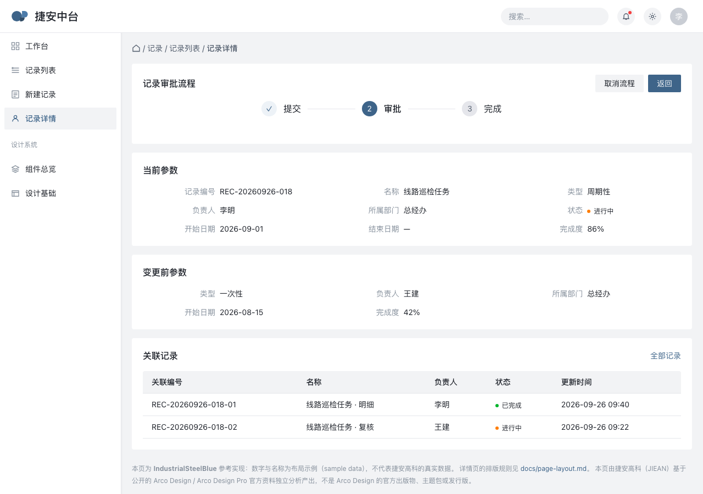

# industrial-steel-blue（工业钢蓝）

[English](README.md) · **中文版**

捷安设计体系（JIEAN Design System）的工业风格包。

> **独立性声明。** `industrial-steel-blue` 由捷安高科（JIEAN）基于公开的官方
> Arco Design / Arco Design Pro 资料独立分析产出，Arco 资料在本项目中仅作为研究基线。
> **本包不是 Arco Design 的官方出版物、主题包、发行版或官方规范，也不代表 Arco 官方立场。**
> Arco 被标注为来源，而不是本包的作者。

## industrial-steel-blue 是什么？

`industrial-steel-blue` 是捷安面向工业场景的应用设计语言。它的交互主色是一枚偏深的
钢蓝（`primary` `#3E6489`），而不是饱和度很高的产品蓝。它完整保留了同门包 `arcopro`
的非颜色层——外壳几何、中性灰、字阶、间距、圆角、数据可视化配色与整套版式语言——只把
主色族替换为由基线自身色阶推导出的十阶钢蓝。

它的定位是**带白名单的超集，不是换色**，而且这个说法是机器验证过的，不是自我声明。
`npm run 8:package-diff` 会从两个包的令牌与示例源码重新推导这层关系：

| 层级 | 与 `arcopro` 的关系 |
|---|---|
| 颜色（34 个角色） | 25 个完全相同 · 5 个按已记录的变换改变 · 4 个新增 |
| 字体（11 个角色） | 10 个完全相同 · 1 个新增（`code`） |
| 间距（13）与圆角（5） | 全部相同 |
| 组件令牌（75 个） | 61 个相同 · 14 个新增 |
| 示例页 | 有据可查的适配，脚本会明确报告为「适配」而非「复制」 |

每个新增令牌都写在脚本的关系表里，任何未经记录的新增都会让校验失败。改变的 5 个颜色是
`primary`、`primary-hover`、`primary-active`、`primary-disabled`、`primary-subtle`；新增的
4 个是 `primary-on-dark` 和让危险操作填充色达到 AA 的 `error-strong` 三阶。

颜色是推导出来的，不是凭手感挑的，而且推导本身是一个脚本：

| 规则 | 取值 |
|---|---|
| 色相 | 统一为 210° |
| 饱和度 | × 0.38 |
| 第 5、6、7 阶的亮度 | × 0.78（承白字与交互的三阶） |

```text
#EDF2F7  #CBD9E8  #A8C0D8  #83A5C7  #4C7BA9  #3E6489  #324C65  #293E54  #1B2A39  #0E1720
 subtle  —        disabled  —       hover    primary  active   —        —        —
```

`npm run 9:steel-ramp` 会从基线和三条规则重新推导全部十阶，与 `DESIGN.md` 不一致即失败；
它同时断言 8 条对比度性质，其中两条真正决定了设计：主色填充上的白字达到 6.197:1，主色作为
`surface` 上的文字是 6.197:1，**高于**基线自身的 5.15:1，而不只是刚好过 AA。

推导过程中查出三件事实（不是审美判断），三项都带着数字写进了契约：

- **基线的错误红承不了白字。** `#F53F3F` 实测 3.71:1。因此危险操作的**填充**改用
  `error-strong` `#CB272D`（5.43:1），悬停 `#A1151E`（7.95:1），按下 `#770813`（11.48:1）。
  这是本语言中唯一一处 hover **变暗**的地方，契约把它记为有意例外并写明原因。
- **更深的蓝需要第二个深色交互色。** `primary` 在 `dark-canvas` 上只有 2.89:1，在
  `dark-elevated` 上只有 1.92:1；`primary-on-dark` `#628DB8` 是为深色面而生的答案，按
  `dark-surface` 的 4.50:1 求解。它在 `dark-canvas` 上 5.13:1，但在 **`dark-elevated` 上仅
  3.41:1**——这一项记为未关闭的缺口，并给出放置规则，而不是四舍五入掉。
- **十阶里有五阶没有角色。** 保留而不删除，因为一个有洞的色阶会诱惑人自行发明。

它的词汇很小，但说出口的每一条都很硬。它不绑定任何组件库：实现可以用 Arco React、Tailwind、
手写 CSS 或任何别的栈，取值与版式都来自这里。

包名是风格包的名字，不是产品名。

## 视觉示例

四个页面，均由仓库内的 HTML 在 1280×900、DPR 1、浅色主题、无 JavaScript、无构建步骤下渲染。
每张 PNG 就放在它对应的页面旁边，且每个页面都是自包含的（样式已内联），因此 `examples/`
是一个「四页 HTML + 四张 PNG」的平铺目录。

| 页面 | 预览 |
|---|---|
| 工作台 —— KPI 行、趋势折线、最近记录表、右侧 rail |  |
| 列表页 —— 查询区、工具条、高密度表格 |  |
| 表单页 —— 三列分组表单、行内状态、固定操作条 |  |
| 详情页 —— 步骤条、当前/变更前参数块、关联记录 |  |

这些预览图是被校验的，不是装饰：`npm run 10:screenshots` 会逐张检查文件是否存在、是否为真正的
PNG、是否精确为 1280×900、是否不比它依据的 HTML 与令牌陈旧，以及**像素上是否真的带着本包声明的
配色**——`canvas`、`surface`、`primary`、`text-primary` 各自的像素数必须达到记录的下限，而基线的
蓝与同门包的品牌红必须一个像素都不出现。重新渲染用 `npm run 11:screenshots:write`。这些图能证明
什么、不能证明什么，写在 `reports/visual-validation.md`。

## 设计来源

本包研究基线是 Arco Design 与 Arco Design Pro，但精确的版本比名字更重要：

| 来源 | 版本 | 提交 | 日期 | 用途 |
|---|---|---|---|---|
| Arco Design | `2.66.16`（最新发布 tag） | `fbf2ec0a8cc28a5d20f1f82de6c2c4196ef66950` | 2026-07-14 | 色阶、动效取值、断点、组件几何 |
| Arco Design Pro | 仓库 `main`（提交信息中的版本串为 `2.8.1`；**无任何 release**） | `bb6aebcceca6` | 2024-04-26 | 外壳与页面模式、实测几何 |
| Google DESIGN.md | `0.4.0`（最新发布） | `9bf8eae67128` | 2026-07-27 | 契约格式、解析器、linter 与导出器 |

研究日期：**2026-09-28**。两点需要说清：Arco Design Pro 没有可固定的 release，因此只记录提交；
DESIGN.md 格式尚在 1.0 之前，因此 CLI 版本在 `package.json` 里钉死，其真实行为记录在
`reports/designmd-validation.md`。

每个来源读到了什么、用在哪里、哪些是刻意不采用的，都写在 `reports/source-audit.md`。参考站的
实测数据是从 `arcopro/reports/evidence/` 引入的，没有重新采集：基线没有变化，重测只会产出同一版
本的证据。

捷安自己的新增部分——钢蓝色族、危险操作阶梯、`code` 字阶角色、组件覆盖与状态覆盖矩阵、动效 /
响应式 / 迭代指南 / 已知缺口 / 参考来源五个章节，以及无障碍决策——在出现的地方都标注为捷安自有。

## DESIGN.md 是什么

`DESIGN.md` 是设计契约，一个文件里装着两样东西：

- **frontmatter 是机器可读的。** 它承载官方 Google DESIGN.md 工具链用于 lint、解析和导出的令牌
  集，是每个数值的唯一真源：本包里不存在任何不在其中的颜色、尺寸、间距、圆角或组件令牌。
- **正文是给人看的。** 它说明每组令牌是干什么的、数字从哪来、取舍了什么、忽略会出什么事。共 13 个
  二级章节：8 个规范章节，加上动效、响应式行为、迭代指南、已知缺口、参考来源。

包里其余内容都由它派生或解释它：`tokens/` 与 `dist/` 由它生成，`docs/` 应用它，`examples/`
演示它，`reports/` 记录它的来历。**任何数值改动都从 `DESIGN.md` 开始**，再经 `npm run 2:export`
向外流动。

## 仓库结构

```text
industrial-steel-blue/
├── DESIGN.md                设计契约：令牌 + 推理
├── README.md                英文版
├── README_zh-CN.md          本文件
├── docs/                    14 篇版式与模式文档
│   ├── foundations.md            令牌背后的模型
│   ├── application-shell.md      页面外框
│   ├── page-layout.md            页面类型与栅格
│   ├── navigation.md             侧栏、面包屑与页签
│   ├── forms.md                  标签、控件、校验、提交条
│   ├── tables.md                 最常用的重负载表面
│   ├── search-filter.md          查询与结果
│   ├── cards.md                  卡片结构与 KPI 卡
│   ├── feedback.md               消息、确认、加载、空态
│   ├── data-visualization.md     图表与指标层
│   ├── workflow.md               多步流程与审批模式
│   ├── permission.md             角色可见性与安全规则
│   ├── accessibility.md          对比度、焦点、键盘、动效
│   └── responsive.md             支持范围与降级方式
├── tokens/
│   └── tokens.json           官方 DTCG 导出
├── dist/
│   ├── tokens.css            官方 CSS 自定义属性导出
│   ├── tailwind.theme.json   官方 Tailwind 主题导出
│   ├── tokens.full.css       派生：262 个自定义属性（无损）
│   └── tokens.full.json      派生：无损，含行高、字体特性与全部 75 个组件令牌
├── examples/                 参考实现，平铺且自包含
│   ├── dashboard.html        + dashboard.png
│   ├── list-page.html        + list-page.png
│   ├── form-page.html        + form-page.png
│   └── detail-page.html      + detail-page.png
└── reports/
    ├── source-audit.md          每个数值的来源
    ├── designmd-validation.md   工具链的真实行为
    ├── visual-validation.md     预览图能证明什么
    ├── machine-validation.json  结构校验结果（机器可读）
    └── evidence/                推导过程与跨包差集证据
```

## 快速开始

```bash
git clone <本仓库>
cd jiean-design-system
npm install                     # 只有一个依赖：@google/design.md
npm run check                   # 校验 → 导出 → 复验 → 色阶 → 差集 → 截图 → 卫生检查
open industrial-steel-blue/examples/dashboard.html
```

需要 Node 18 或更高。没有构建步骤：示例页是自包含 HTML（样式已内联），可以直接从文件系统打开。

脚本一览：

| 命令 | 作用 | 何时失败 |
|---|---|---|
| `npm run 1:validate` | 用官方工具链 lint `DESIGN.md`，再跑 12 项结构校验 | 契约无法解析、lint 报错或结构校验不通过 |
| `npm run 2:export` | 用官方 CLI 导出三种格式，再派生无损产物 | CLI 失败或产物为空 |
| `npm run 3:verify-generated` | 26 项：出处、无损、工具链已知限制、对比度 | 任何产物与契约漂移 |
| `npm run 4:capture` | 渲染 `arcopro` 示例页并记录计算样式 | 页面达不到 1270×848 视口或 Chrome 失败 |
| `npm run 5:compare` | 用 `arcopro` 页面与记录基线比对 | 任何被比对的值漂移 |
| `npm run 6:hygiene` | 占位符、链接、JSON 合法性、必需文件、命名 | 链接失效、文件缺失、占位符残留 |
| `npm run 7:brand-ramp` | 从品牌字面值重新推导 `brandcolor` 色阶 | 推导值漂移 |
| `npm run 8:package-diff` | 证明两组跨包关系：`arcopro`↔`brandcolor` 只差颜色；`arcopro`↔`industrial-steel-blue` 只在记录的白名单内不同 | 白名单外有令牌移动，或有未记录的新增 |
| `npm run 9:steel-ramp` | 重新推导十阶钢蓝并断言 8 条对比度性质 | 色阶或比值漂移，或契约中的说法与推导矛盾 |
| `npm run 10:screenshots` | 校验四张预览：存在、PNG 合法、精确 1280×900、不过期、像素配色 | 预览缺失、过期、尺寸不对或颜色不对 |
| `npm run 11:screenshots:write` | 重新渲染四张预览 | 页面无法达到 1280×900 |
| `npm run check` | `1 → 2 → 3 → 7 → 9 → 8 → 10 → 6` | 同上；这是 CI 的闸门 |
| `npm run check:visual` | `4 → 5` | 同上；需要 Chrome，因此不进 CI |

## 人工开发用法

不依赖 AI 工具、React 工程或本仓库工具链，也能按 `industrial-steel-blue` 开发。

1. **读设计规范。** 先读 `DESIGN.md`；写哪部分 UI 就读哪部分的正文，frontmatter 是给工具看的。
2. **查语义令牌。** 34 个颜色按角色命名——`primary`、`canvas`、`surface`、`text-secondary`、
   `border`、`primary-on-dark`——而不是按外观。完整解析集见 `dist/tokens.full.json`。
3. **用生成的 CSS。** `dist/tokens.full.css` 定义了 262 个自定义属性，可直接用于普通 CSS；想要
   官方原样输出就用 `dist/tokens.css`。`dist/tailwind.theme.json` 可直接放进 Tailwind 配置。
4. **找组件规范。** `docs/` 每个模式区域一篇，含取值、状态、密度与对比度说明。
5. **找企业级模式。** `docs/workflow.md`（多步与审批）、`docs/permission.md`（角色可见性）、
   `docs/tables.md`（高密度表格）、`docs/feedback.md`（最常被漏掉的状态）。
6. **在任何技术栈里实现。** 示例是不依赖框架的 HTML 与 CSS；同样的取值可用于 React、Vue 或
   服务端渲染页面。`DESIGN.md` 不指向任何组件库。
7. **验证你的改动。** 改完契约跑 `npm run check`；改过页面则跑
   `npm run 11:screenshots:write` 再跑 `npm run 10:screenshots`。

## 通用 AI 编程助手用法

任何厂商的任何可用编程助手：

```text
在实现或修改 UI 之前：

1. 读 industrial-steel-blue/DESIGN.md。
2. 读 industrial-steel-blue/docs/ 下的相关文件。
3. 把 JIEAN Design System / industrial-steel-blue 视为权威的视觉与交互规范。
4. 复用规范中的令牌与模式。
5. 不要引入与之冲突的设计取值。
```

## Codex 示例

```text
先读 AGENTS.md 并遵循它。
任务：做车间模块的设备巡检记录列表。
这是列表页：写任何 UI 之前先读 industrial-steel-blue/docs/tables.md、
search-filter.md 与 page-layout.md；取值用
industrial-steel-blue/dist/tokens.full.css，表格各状态取 DESIGN.md 的 State coverage。
```

## Claude Code 示例

```bash
claude "读 AGENTS.md 与 industrial-steel-blue/DESIGN.md，然后按
        docs/page-layout.md 与 cards.md 实现巡检详情页。"
```

## Gemini CLI 示例

```bash
gemini -p "遵循 AGENTS.md。用 industrial-steel-blue 做一个设备登记表单：
           先读 DESIGN.md 以及 docs/forms.md、docs/application-shell.md，
           只使用规范里的令牌。"
```

## Cursor / Copilot 用法

写进项目的规则文件：

```text
JIEAN Design System / industrial-steel-blue 是本仓库权威的设计规范。
生成 UI 前先读 AGENTS.md，再读 industrial-steel-blue/DESIGN.md 与
industrial-steel-blue/docs/ 下的相关文档。不要引入规范里没有的颜色、尺寸、
间距、圆角或模式。
```

## 令牌用法

按消费方选择产物：

| 消费方 | 用哪个 | 原因 |
|---|---|---|
| 普通 CSS，任意框架 | `dist/tokens.full.css` | 262 个自定义属性：颜色、字阶、间距、圆角、组件令牌与行高，全都有 |
| Tailwind | `dist/tailwind.theme.json` | 官方主题输出；每个字号带行高与字重 |
| 设计工具、其他语言 | `tokens/tokens.json` | 官方 DTCG 输出 |
| 需要完整解析集 | `dist/tokens.full.json` | 无损：包含官方格式装不下的内容 |

```css
.card {
  background: var(--color-surface);
  border: 1px solid var(--color-border);
  border-radius: var(--rounded-md);
  padding: var(--spacing-card);
}
```

无论用哪份产物，两条规则都成立：**按角色引用令牌，而不是按数值**；**有令牌的数值不要硬编码**。
如果需要的值没有令牌，那是契约的缺口——应当作为契约变更提出，而不是本地破例。

## 验证

`npm run check` 是闸门，它跑的一切都是确定性的、不需要浏览器：用官方工具链 lint 并结构校验
`DESIGN.md`、用官方 CLI 导出令牌、核对生成产物与契约一致（包括产物中记录的契约 sha256 是否仍然
匹配）、重新推导两条颜色色阶、证明两组跨包关系、校验四张预览（含像素），并做仓库卫生检查。CI 跑
同一条命令，因此本地绿就是 CI 绿。

三份结果值得知道，而且每份都是产物而不是一句话：

- **`reports/machine-validation.json`** —— 12 项结构校验及各自证据：全篇引用可解析、章节存在与
  顺序、组件覆盖矩阵、状态覆盖、字体与颜色覆盖、外部体系污染与旧命名扫描。这一层是官方格式表达
  不了的。
- **`reports/evidence/palette-derivation.json`** —— 十阶推导、三条变换规则、8 条对比度断言及被
  比对的数值。
- **`reports/evidence/package-diff.json`** —— 上文那组跨包证明，含源码层比对与「未复制文件及原因」
  清单。

`reports/designmd-validation.md` 记录官方工具链的真实行为，包括三条塑造了契约写法的行为：定义但
未被引用的颜色会被报告、`borderColor` 不是合法子令牌、无单位 `lineHeight` 会被静默丢弃。
`reports/visual-validation.md` 记录四张预览能证明与不能证明什么。

## 如何更新

1. 在 `industrial-steel-blue/DESIGN.md` 里改数值。别处都不存数值。
2. `npm run 2:export` —— 重新生成令牌产物，派生文件里会写入契约 sha256。
3. `npm run 3:verify-generated` —— 确认导出仍然一致、没有丢东西。若某项限制检查失败，说明工具链
   行为变了，这值得在仓库其他部分跟进之前先知道。
4. `npm run 9:steel-ramp` —— 若改的是主色，推导必须与契约一致；不一致说明两者必有一错，脚本会指出
   哪几个值对不上。
5. 若改动影响外壳、某个页面或组件外观，用 `npm run 11:screenshots:write` 重新渲染预览。
6. 改动与 `docs/` 中的说法冲突时同步更新；文档只校验链接，不校验一致性，保持一致是评审责任。
7. `npm run check`，然后补一条 `CHANGELOG.md`。

颜色层的改动另有两道闸门：`npm run 9:steel-ramp` 重新推导色族，`npm run 8:package-diff` 证明
记录白名单之外没有任何东西移动。相反，改动共享的基线几何属于仓库级改动：必须在所有继承它的包里同时
改，`8:package-diff` 会在改完之前一直失败。

## 版本策略

`industrial-steel-blue` 按设计体系而非软件库来版本化。包版本是 `MAJOR.MINOR.PATCH`，四类改动按
「消费方要做什么」区分：

| 改动 | 版本 | 消费方要做什么 |
|---|---|---|
| 仅文档——正文、示例、澄清 | patch | 什么都不用做 |
| 同一角色同一意图内的数值改动（纠正色值、收紧间距） | patch | 重新导入产物 |
| 新增令牌、角色、模式，或视觉行为以新增方式变化 | minor | 重新导入，按自己节奏采纳 |
| 令牌含义改变、令牌删除、模式被替换，或重新导入后已有页面外观会变 | major | 安排迁移；不要静默重新导入 |

**只有角色意图不变时，改色值才算 patch**——如果 `primary` 不再代表钢蓝，那无论改了几个字符都是
major。而且 **major 必须给出替代值**：本体系不留「已废弃但无继任者」的值，因为无法迁移的消费方就
留不下来。

## 已知限制

写在这里，是因为一个隐藏自己边界的体系一定会被用过头。每一条也在契约的 Known Gaps 章节里，那里是
权威表述。

1. **`primary-on-dark` 在 `dark-elevated` 上达不到 AA（3.41:1）。** 它在 `dark-canvas` 上
   5.13:1、在 `dark-surface` 上 4.50:1，因此给出的是一条放置规则：带文字的深色控件放在
   `dark-surface`。要真正解决，需要一个专用于深色抬升面的第二交互色，本包没有定义。
2. **危险按钮 hover 变暗，与其它所有填充控件相反。** 它沿红色族向下走（`#CB272D` → `#A1151E`
   → `#770813`），因为另一条路是填色承不了 AA 白字。若有人为了「一致性」把 hover 改成变亮，对比度
   失败就会回来。
3. **深色面族不是深色主题。** 九个值是带实测对比度的锚点；真正要上深色 UI 的页面必须自行重审它用到的
   每一对颜色。
4. **十阶钢蓝里有五阶没有角色。** 需要第四条图表色或更深的按下态时会用到它们，那属于契约变更，不是
   本地决定。
5. **官方导出都不带 75 个组件令牌，也只有一个带字体。** `dist/tokens.css` 只有颜色、间距和圆角。
   需要组件令牌或字体时用 `dist/tokens.full.css` 或 `dist/tokens.full.json`。确切损失见
   `reports/designmd-validation.md`。
6. **契约里的 `lineHeight` 必须写成 px 尺寸。** 无单位倍数会被工具链静默丢弃——不报错也不告警。
   契约统一用像素值，并由 `3:verify-generated` 断言这个坑仍然存在。
7. **基线在 1100px 以下不响应式**，本包记录的版式同样如此：`--component-shell-content-width` 是
   下限而不是固定宽度。1100px 以下版式性质会变，`docs/responsive.md` 说明了那时该怎么办。响应式
   行为里两个更小的断点标注为 `INFERRED`（推断），不是实测。
8. **四张预览只渲染浅色主题，且只渲染桌面。** 它们不渲染深色锚点、色卡或字体样张，也不能替代在
   真实屏幕上以其它尺寸或密度查看。
9. **状态未做视觉比对。** hover、focus、按下、禁用、加载、错误都有规范、有令牌、有对比度审核，覆盖
   矩阵让这套状态可被评审，但静态渲染并不会真正跑到它们。
10. **示例是参考实现，不是组件库。** 它们是内联样式的 HTML，用来演示规范，不适合原样复制进产品。
11. **与基线的关系是被证明的，「保真度」没有被主张。** 本包并不打算长得像 Arco Design Pro；它复用
    的是结构与几何，刻意改变的部分记录在 `reports/evidence/package-diff.json`。
