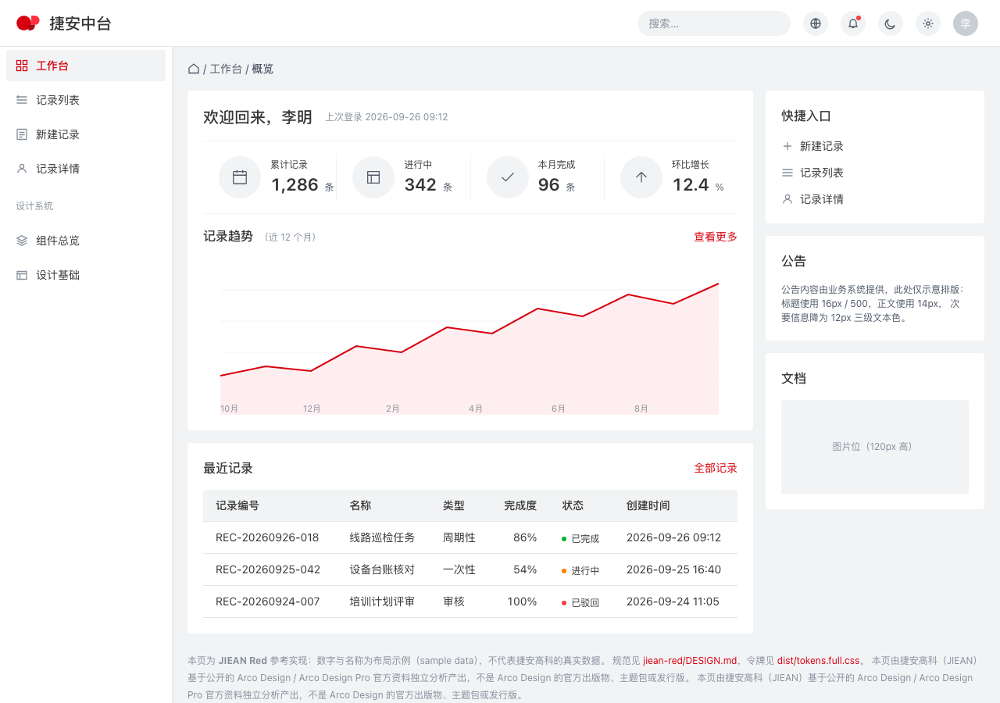
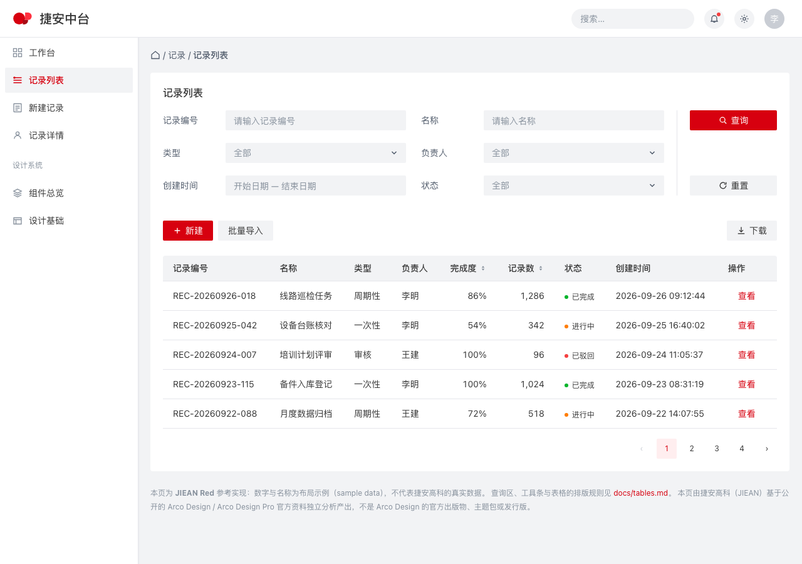
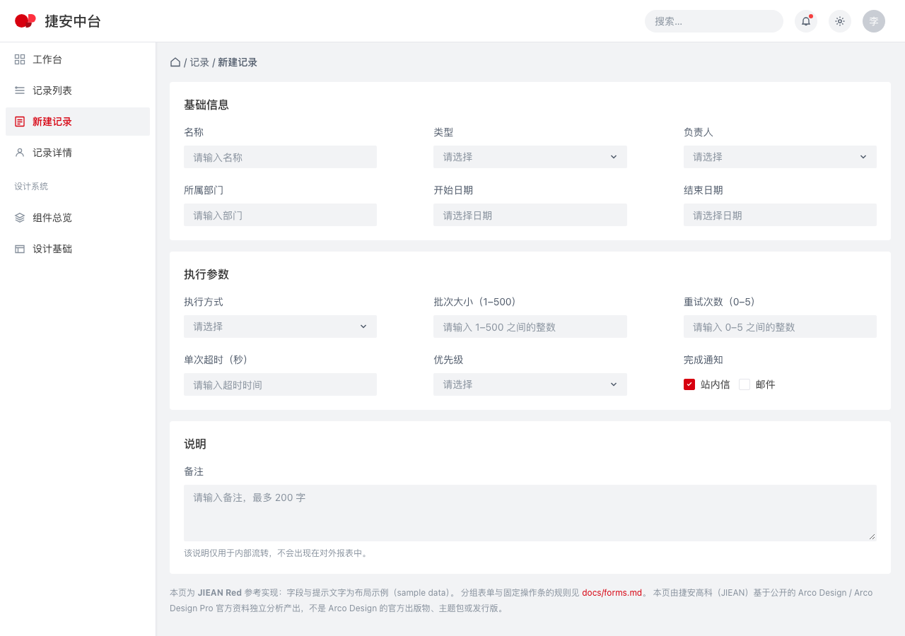
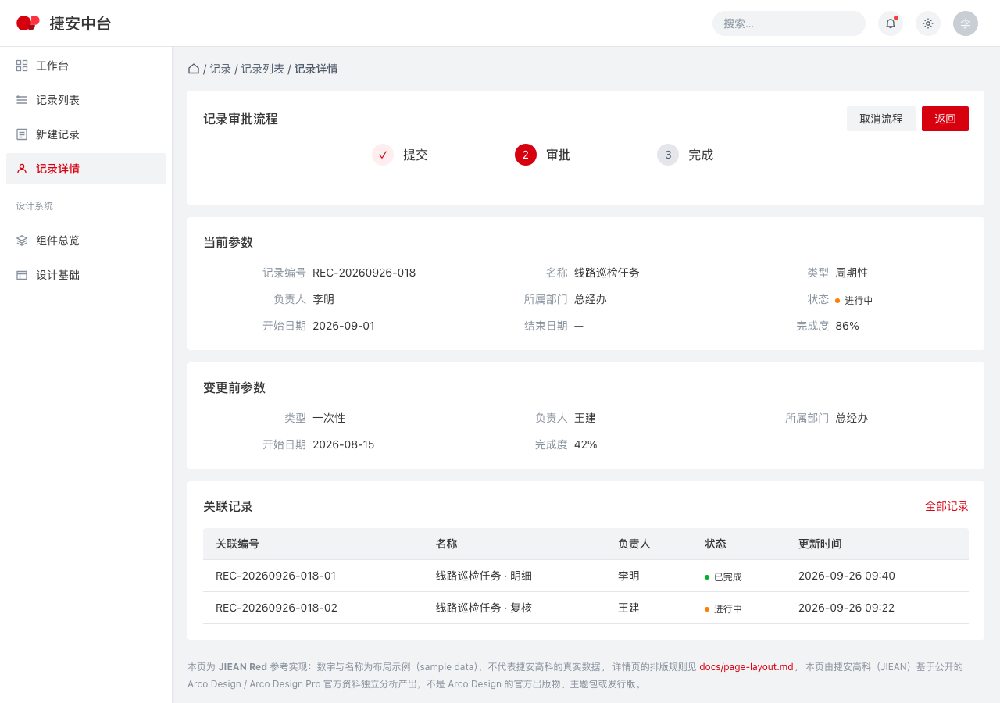

# jiean-red（捷安红）

**中文版** · [English version](README.md)

JIEAN Design System 的企业级 style package —— 捷安红（JIEAN Red）品牌色版。

## jiean-red 是什么？

`jiean-red` 是 JIEAN 的企业应用 style package，采用捷安品牌色：令牌集、成文的模式语言与参考实现都与同族包 `arco-blue` 完全相同，只替换了其中一层——颜色。

34 个颜色角色里只有 8 个不同，其余 25 个与 `arco-blue` 逐字节相同；非颜色令牌一个都没动：同样是 11 个排版角色、13 级间距、5 种圆角与 75 个组件令牌。这个说法是被验证的，不是被声称的——`npm run 8:package-diff` 会从两个包渲染出的截图重新推出这个结论。

| 角色 | `arco-blue` | `jiean-red` | 来源 |
|---|---|---|---|
| `primary` | `#165DFF` | `#D7000F` | 捷安红，品牌给定 |
| `primary-hover` | `#4080FF` | `#FF303F` | 推导：亮度不变，色相换成品牌红 |
| `primary-active` | `#0E42D2` | `#A80B16` | 推导：亮度不变，色相换成品牌红 |
| `primary-disabled` | `#94BFFF` | `#FFA4AA` | 推导：亮度不变，色相换成品牌红 |
| `primary-subtle` | `#E8F3FF` | `#FFEEEF` | 推导：亮度不变，色相换成品牌红 |
| `text-primary` | `#1D2129` | `#353535` | 深灰，品牌给定 |
| `tooltip` | `#1D2129` | `#353535` | 深灰，与 `text-primary` 同一角色 |
| `mask` | `rgba(29, 33, 41, 0.6)` | `rgba(53, 53, 53, 0.6)` | 深灰，alpha 不变 |

推导规则是写明且可校验的，不靠口味：每一步都保持 `arco-blue` 对应步的 WCAG 相对亮度，把色相移到品牌红、保留该步的饱和度，因此整张对比度审计连同比值一起迁移，不必逐色重新论证。`npm run 7:jiean-red-ramp` 会从品牌字面值重新推导这四步，与 `DESIGN.md` 不符即失败；亮度对照表在 `DESIGN.md` › Colors。

由于主色与状态色都是红，这个调色板多了一条 `arco-blue` 不需要的规则：`primary` 承担**身份与主操作**——填充按钮、链接、选中态、聚焦环；`error` `#F53F3F` 承担**状态**——校验失败、破坏性操作、失败横幅。两者永不互换，`docs/accessibility.md` 把它写成规则并附上背后的数字。

它在词汇上刻意保持小，在少数几件它明确表态的事上保持严格。它不规定组件库。实现可以用 Arco React、Ant Design、Tailwind 构建链、手写 CSS，或任何其他东西。无论用哪一种，数值与模式都来自这里。

这个名字是 style package 的名字，不是产品名。它说明你正在读的是哪一个包，就像 `jiean-red-compact` 会说明它自己是谁。

## 视觉示例

四个页面，均由仓库内的 HTML 在 1280×900、DPR 1、浅色主题、无 JavaScript、无构建步骤下渲染。
每张 PNG 就放在它对应的页面旁边，且每个页面都是自包含的（样式已内联），因此 `examples/`
是一个「四页 HTML + 四张 PNG」的平铺目录。

| 页面 | 预览 |
|---|---|
| 工作台 —— KPI 行、趋势折线、最近记录表、右侧 rail |  |
| 列表页 —— 查询区、工具条、高密度表格 |  |
| 表单页 —— 三列分组表单、行内状态、固定操作条 |  |
| 详情页 —— 步骤条、当前/变更前参数块、关联记录 |  |

这些预览图是被校验的，不是装饰：`npm run 10:screenshots` 会逐张检查文件是否存在、是否为真正的
PNG、是否精确为 1280×900、是否不比它依据的 HTML 与令牌陈旧，以及**像素上是否真的带着本包声明的
配色**——`canvas`、`surface`、`primary`、`text-primary` 各自的像素数必须达到记录的下限，另外
两个同门包的主色必须一个像素都不出现。重新渲染用 `npm run 11:screenshots:write`。这些图能证明
什么、不能证明什么，写在 `reports/visual-validation.md`。

## 设计来源

`jiean-red` 反推自 **Arco Design Pro**——由字节跳动维护的企业应用模板——及其官方主题包。

| 来源 | 使用的版本 | 作用 |
|---|---|---|
| `react-pro.arco.design` | 线上、已登录，2026-09-26 | 视觉参考：页面实际渲染成什么样 |
| `@arco-themes/react-arco-pro` | 0.0.7（MIT） | 令牌值：颜色、排版、间距、圆角 |
| `arco-design-pro` 源码 | commit `bb6aebcc…`，2024-04-26（MIT） | 结构意图：各区域尺寸、线条画在哪里 |
| `@arco-design/web-react` | 2.66.16（MIT） | 组件几何 |

颜色层不来自这条源流。品牌只给了两个值——捷安红 `#D7000F`（R215 G0 B15）与深灰 `#353535`（R53 G53 B53）——主色族其余四步由上面的规则推导。包内其他数值都原样继承自 `arco-blue`，因此上面这张来源表对本包同样适用。

"以源码优先、不靠视觉猜测"是这个包建立时遵循的规则；两者不一致时，以对运行页面的实测为准。四个参考页面在 1270×848 视口下渲染，其计算样式与像素都被采集；本包与它们比对的结果在 `reports/visual-validation.md`。每个数值的出处见 `reports/source-audit.md`，原始读数保存在 `reports/evidence/`。

JIEAN 自己补充的部分——密度规则、空/超长/矛盾状态、权限与流程模式、无障碍决策——都在出现处作了标记。本包中没有任何内容暗示它是 Arco 官方产品。

## DESIGN.md 是什么

`DESIGN.md` 是设计契约。它在一个文件里是两份文档：

- **frontmatter 是给机器读的。** 它存放官方 Google DESIGN.md 工具链用于 lint、解析与导出的令牌集。它是每个数值的唯一真源：本包中不存在任何不写在其中的颜色、尺寸、间距或圆角。
- **正文是给人读的。** 它说明每组令牌是干什么用的、数字从哪来、做了哪些取舍，以及忽视它们会出什么问题。

本包中其他一切都是从它派生或对它进行解释：`tokens/` 与 `dist/` 由它生成，`docs/` 应用它，`examples/` 演示它，`reports/` 展示它的出处。**任何数值改动都从 `DESIGN.md` 开始**，再通过 `npm run 2:export` 向外流动。

这个格式不是自创的家法。它是 Google 的 DESIGN.md 规范，其版本号连同工具链的真实行为（包括那些被静默丢弃的东西）都记录在 `reports/designmd-validation.md`。

## 仓库结构

```text
jiean-red/
├── DESIGN.md                契约：令牌 + 理由
├── README.md                包手册（英文）
├── README_zh-CN.md          包手册（中文，本文件）
├── docs/                    14 篇模式文档
│   ├── foundations.md            令牌背后的模型
│   ├── application-shell.md      页面外框
│   ├── page-layout.md            页面类型与栅格
│   ├── navigation.md             侧栏、面包屑与标签页
│   ├── forms.md                  标签、控件、校验、提交条
│   ├── tables.md                 主力数据面
│   ├── search-filter.md          查询与结果
│   ├── cards.md                  卡片解剖与 KPI 卡
│   ├── feedback.md               消息、确认、加载、空状态
│   ├── data-visualization.md     图表与指标层
│   ├── workflow.md               多步与审批模式
│   ├── permission.md             按角色可见的 UI 与安全规则
│   ├── accessibility.md          对比度、焦点、键盘、动效
│   └── responsive.md             支持范围与降级行为
├── tokens/
│   └── tokens.json               官方 DTCG 导出
├── dist/
│   ├── tokens.css                官方 CSS 自定义属性
│   ├── tailwind.theme.json       官方 Tailwind 主题
│   ├── tokens.full.css           派生：217 个自定义属性（无损）
│   └── tokens.full.json          派生：无损，含行高、
│                                 字体特性与全部 75 个组件令牌
├── examples/                 参考实现，平铺且自包含
│   ├── dashboard.html        + dashboard.png
│   ├── list-page.html        + list-page.png
│   ├── form-page.html        + form-page.png
│   └── detail-page.html      + detail-page.png
└── reports/
    ├── source-audit.md          每个数值的来源
    ├── designmd-validation.md   工具链的真实行为
    ├── visual-validation.md     预览图能证明什么
    ├── machine-validation.json  结构校验结果（机器可读）
    └── evidence/                推导过程与跨包差集证据
```

## 快速开始

```bash
git clone <this repository>
cd jiean-design-system
npm install          # one dependency: @google/design.md
npm run check        # lint + export + verify + ramp + hygiene
open jiean-red/examples/dashboard.html
```

Node 18 或更高。示例没有构建步骤：直接打开 HTML 文件，或用任意静态服务器托管仓库根目录。

脚本：

| 命令 | 做什么 | 何时失败 |
|---|---|---|
| `npm run 1:validate` | 对 `DESIGN.md` 做 lint，打印令牌数量与小节名 | 契约无法解析，或 lint 报出 error |
| `npm run 2:export` | 用官方 CLI 导出三种格式，再派生无损文件对 | CLI 失败，或某个产物为空 |
| `npm run 3:verify-generated` | 26 项检查：出处、无损性、已知工具链限制、对比度 | 任何产物与契约发生漂移 |
| `npm run 4:capture` | 无头渲染四个示例页并记录计算样式 | 某页未达到 1270×848 视口，或 Chrome 失败 |
| `npm run 5:compare` | 对参考值比对 75 项：四个页面对 16 项像素检查、dashboard 38 项地标、其余三页 21 项外壳地标 | 任何被比对的数值发生漂移 |
| `npm run 6:hygiene` | 占位符、链接、JSON 合法性、必需文件、命名 | 链接失效、文件缺失、占位符残留 |
| `npm run 7:jiean-red-ramp` | 由 `#D7000F` 与同族契约重新推导主色族四步 | 某个推导步、品牌字面值或品牌灰角色发生漂移 |
| `npm run 8:package-diff` | 比较两个包的令牌与示例源码，归一化颜色与包名后要求完全一致 | 颜色层之外的令牌发生移动，或源码出现颜色与包名之外的差异 |
| `npm run check` | `1 → 2 → 3 → 7 → 8 → 6` | 同上；这是 CI 的门禁 |
| `npm run check:visual` | `4 → 5` | 同上；需要 Chrome，因此不进 CI |

## 人类开发者用法

你不需要 AI 工具、React 工程或本仓库的工具链，就能基于 `jiean-red` 开发。

1. **读设计规范。** `DESIGN.md`。为你正在构建的那部分 UI 读正文小节；frontmatter 是给工具的。
2. **查看语义令牌。** 34 种颜色按角色命名——`primary`、`canvas`、`surface`、`text-secondary`、`border`——而不是按外观命名。解析后的完整集合见 `dist/tokens.full.json`，其中包含行高、字体特性与组件令牌。
3. **使用生成的 CSS。** `dist/tokens.full.css` 定义了 217 个自定义属性，可直接用于普通 CSS；若你要 CLI 输出的官方原样结果，则用 `dist/tokens.css`。`dist/tailwind.theme.json` 可直接放入 Tailwind 配置。
4. **查组件指引。** `docs/`——每个模式领域一篇文档，各自包含数值、状态、密度与对比度说明。
5. **查企业级模式。** `docs/workflow.md`（多步与审批）、`docs/permission.md`（按角色可见的 UI）、`docs/tables.md`（高密度数据面）、`docs/feedback.md`（最常被遗忘的那些状态）。
6. **在任何技术栈里实现。** 示例是不依赖框架的 HTML 与 CSS；同样的数值在 React、Vue 或服务端渲染页面中都适用。`DESIGN.md` 中没有任何内容指向某个组件库。
7. **验证你的改动。** 改完契约后跑 `npm run check`；若动了页面，跑 `npm run check:visual` 与参考地标比对。

## 通用 AI 编码代理用法

任何具备能力的编码代理，不论出自哪家：

```text
在实现或修改 UI 之前：

1. 阅读 jiean-red/DESIGN.md。
2. 阅读 jiean-red/docs/ 下的相关文件。
3. 把 JIEAN Design System / jiean-red 当作权威的
   视觉与交互规范。
4. 复用已记录的令牌与模式。
5. 不要引入与规范冲突的设计数值。
```

这就是全部指令。它刻意保持供应商中立：权威是文件，而不是读它的工具。

## Codex 示例

```text
先读 AGENTS.md，然后照它做。
任务：为检修模块构建工单列表页。
这是一个列表页：写任何 UI 之前先读 jiean-red/docs/tables.md、
search-filter.md 与 page-layout.md。数值使用 jiean-red/dist/tokens.full.css。
```

## Claude Code 示例

```bash
claude "先读 AGENTS.md 与 jiean-red/DESIGN.md，然后按照
        jiean-red/docs/page-layout.md 与 cards.md 构建巡检详情页。"
```

## Gemini CLI 示例

```bash
gemini -p "遵循 AGENTS.md。使用 jiean-red 为设备登记构建表单页：
           先读 DESIGN.md 以及 docs/forms.md 与 docs/application-shell.md，
           只使用已记录的令牌。"
```

## Cursor / Copilot 用法

加入工程的规则文件：

```text
JIEAN Design System / jiean-red 是本仓库的权威设计规范。
生成 UI 之前先读 AGENTS.md，再读 jiean-red/DESIGN.md 以及
jiean-red/docs/ 下的相关文档。绝不引入规范中没有的颜色、尺寸、
间距、圆角或模式。
```

## 使用令牌

按消费方选择产物：

| 消费方 | 使用 | 原因 |
|---|---|---|
| 普通 CSS、任意框架 | `dist/tokens.full.css` | 217 个自定义属性：所有颜色、排版角色、间距、圆角与组件令牌，含行高 |
| Tailwind | `dist/tailwind.theme.json` | 官方主题输出；每个字号带行高与字重 |
| 设计工具、其他语言 | `tokens/tokens.json` | 官方 DTCG 输出 |
| 需要解析后完整集合的场景 | `dist/tokens.full.json` | 无损：包含任何官方格式都不承载的内容 |

```css
.card {
  background: var(--color-surface);
  border: 1px solid var(--color-border);
  border-radius: var(--rounded-md);
  padding: var(--spacing-card);
}
```

无论用哪种产物，都有两条规则：**按角色引用令牌，而不是按数值**，以及**不要硬编码已有令牌的数值**。若某个需要的数值没有对应令牌，说明契约存在缺口——应作为契约变更提出，而不是在本地做例外。

## 校验

`npm run check` 是门禁，而且它跑的每一步都精确且不需要浏览器：用官方 linter 检查 `DESIGN.md`、用官方 CLI 导出令牌、把生成的产物与契约核对（包括产物中记录的契约 sha256 是否仍然一致）、重新推导品牌色阶、证明 `jiean-red` 与 `arco-blue` 只差颜色层、并检查仓库卫生。CI 运行同一条命令，因此本地绿等于 CI 绿。

这条跨包证明就是 `npm run 8:package-diff`，也是本包存在理由的机器可验证形式——结果留在 `reports/evidence/package-diff.json`。它分两层：

- **令牌层**——34 个颜色角色里，只有脚本色值映射表中的那 9 个允许不同，且必须等于记录值；排版（11）、间距（13）、圆角（5）必须逐字节相同；75 个组件令牌把所有颜色字面量替换为其所属角色后必须完全相同。
- **源码层**——四个示例页（样式已内联）在把包名与其中出现的 25 个颜色角色归一化后，必须逐字符相同。任何规则、长度、选择器、字体或状态都不许不同；不属于任何调色板的颜色字面量会被报为无法解释的差异，而不是悄悄放过。

`npm run check:visual` 是渲染层比对，只在本地跑：无头渲染四个示例页，并与记录的参考值比对 75 项——四个页面对 16 项像素检查、dashboard 38 项地标、其余三页 21 项外壳地标——这需要浏览器能拿到确定的 1270×848 视口。本包已于 2026-09-28 跑过这一步，结果为 75/75 全部一致；`reports/visual-validation.md` §3 记录了结果，§5 记录了让它可以稳定复现的视口校准。

## 更新 jiean-red

1. 在 `jiean-red/DESIGN.md` 中修改数值。其他文件里没有任何数值。
2. `npm run 2:export`——重新生成令牌产物。契约的 sha256 会写入派生文件。
3. `npm run 3:verify-generated`——确认导出仍然一致、没有丢东西。某个限制检查被打破，意味着工具链行为变了，这值得在仓库其余部分跟进之前就知道。
4. 若改动影响外壳、某个页面或某个组件的外观，更新 `examples/` 并跑 `npm run check:visual`。
5. 若改动与 `docs/` 中写的内容冲突，更新 `docs/`。文档只被检查链接，不被检查一致性——让它们保持同步是评审责任。
6. `npm run check`，然后在 `CHANGELOG.md` 添加条目。

颜色层的改动还多两道门，而这两道正是本包存在的意义：`npm run 7:jiean-red-ramp` 从品牌字面值重新推导主色族四步，`npm run 8:package-diff` 证明颜色层之外没有任何东西移动。因此品牌色在上游变化时，得到的是推导出的一族颜色，而不是五个手改的十六进制值。

工具链版本固定在 `package.json` 中。更新它是一次刻意变更：先读 `reports/designmd-validation.md`，改动版本固定值，重跑 `npm run 3:verify-generated`，并预期在已有行为发生变化时更新那份报告。不要浮动版本。

## 版本策略

`jiean-red` 按设计系统版本化，而不是按库版本化。包版本为 `MAJOR.MINOR.PATCH`，四类改动的区分依据是消费方需要做什么：

| 改动 | 版本 | 消费方要做什么 |
|---|---|---|
| 仅文档——正文、示例、澄清 | patch | 什么都不用做 |
| 同一角色与意图内的令牌值改动（修正的十六进制、收紧的间距级） | patch | 重新导入产物 |
| 新令牌、新角色、新模式；或视觉行为以增量方式变化 | minor | 重新导入，按自己的节奏采用 |
| 令牌含义变化、令牌被移除、模式被替换，或既有页面在重新导入后外观会不同 | major | 安排迁移；不要静默重新导入 |

有两点值得直说。**十六进制值变化只有在角色保持其意图时才算 patch**——如果 `primary` 不再表示捷安红，那就是 major，无论改了几个字符。以及**major 变更必须给出替代方案**：这个系统不容纳"被废弃却没有后继"的数值，因为无法迁移的消费方就无法留下。

契约格式的版本单独演进，记录在 `reports/designmd-validation.md`；DESIGN.md 格式的改动是仓库变更，不是设计变更，永远不构成改动令牌值的理由。

## 已知限制

写在这里，因为一个隐瞒自身限制的设计系统会被用到超出限制。

1. **没有任何官方导出承载那 75 个组件令牌，只有一种承载排版。** `dist/tokens.css` 只有颜色、间距与圆角。需要组件令牌或排版时，用 `dist/tokens.full.css` 或 `dist/tokens.full.json`。原因与确切丢失内容见 `reports/designmd-validation.md`。
2. **契约中 `lineHeight` 必须写成 px 尺寸。** 无单位倍数会被工具链静默丢弃——不报错、不警告。契约使用像素值，`3:verify-generated` 断言这个坑仍然存在。
3. **参考实现在 1100px 以下不响应式**，本系统记录的布局同样如此：`--component-shell-content-width` 是最小值，不是固定宽度。低于 1100px 时布局性质会变化，`docs/responsive.md` 说明此时应当是什么样。
4. **14px 文本只有一种行高，而参考实现有两种。** 参考实现中外壳里的 14px 文本行盒为 21px，表格单元格里为 22.001px；本系统一律使用 22px。该实测属于 `arco-blue`；本包 `reports/visual-validation.md` §3 说明它为何同样描述本包。
5. **交互状态未做视觉比对。** hover、focus、pressed 有规定并做过对比度审计，但保真度比对是静态渲染。
6. **示例是参考实现，不是组件库。** 它们是 HTML、一份样式表与令牌文件，用来演示规范。它们不打算被原样复制进产品。
7. **官方 CLI 的 `css-tailwind`、`tailwind` 与 `diff` 未使用。** 本包所需的交付用不到它们；见 `reports/designmd-validation.md` §7。
8. **主色与状态色是相邻的两种红。** `primary` `#D7000F` 与 `error` `#F53F3F` 的最大通道差为 46/255，两者的 `-subtle` 浅色只差 7/255，因此浅色底永远不能单独承载语义。角色规则——品牌红管身份与主操作、状态红管状态——写在 `docs/accessibility.md`，并在最容易搞错的地方重复（`docs/feedback.md`、`docs/data-visualization.md`）。
9. **品牌灰只接管浅色主题的深色锚点。** `text-primary`、`tooltip` 与 `mask` 为 `#353535`；六个 `dark-*` 锚点原样继承自 `arco-blue`，本包依然不校验完整的暗色主题——与同族包同样的限制，只是现在多了一条"上线暗色 UI 前必须重新审计"的理由。
10. **`text-primary` 比 `arco-blue` 浅**（`#353535` vs `#1D2129`），因此 `surface` 上的正文对比度为 12.27:1 而非 16.13:1。仍远高于 AA（4.5:1），也高于正文字号的 AAA（7:1），但确实是一次降低：E1 的 `text-tertiary` 行为与 E3 的状态红不变，而正文余量从此更接近中灰体系而非墨黑体系。
11. **主色族五步里有四步是推导值，不是品牌给定的。** 品牌只给了一个红，其余由亮度守恒规则推出。若品牌重新给出红色，`npm run 7:jiean-red-ramp` 决定色阶变成什么样，取值可能因取整而移动一两个通道。
12. **渲染证据只覆盖"是否一致"，不等于设计评审。** 该比对核对的是几何与本包声明的配色，不判断品牌红在屏幕上的观感；此处也没有在第二台显示器上做过测量。
